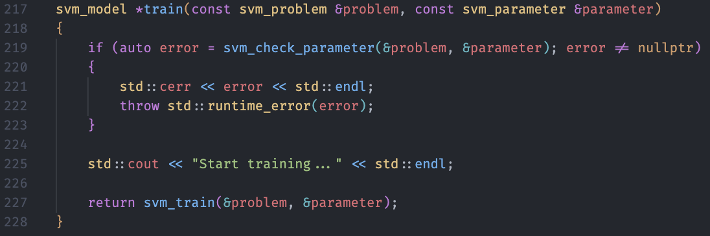
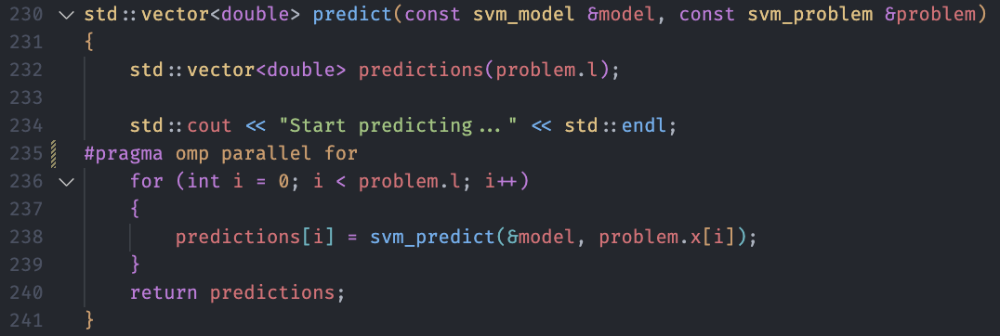
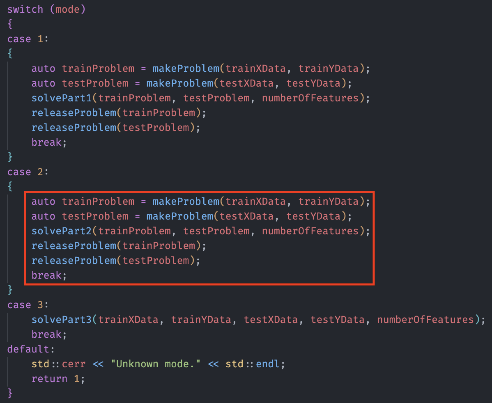
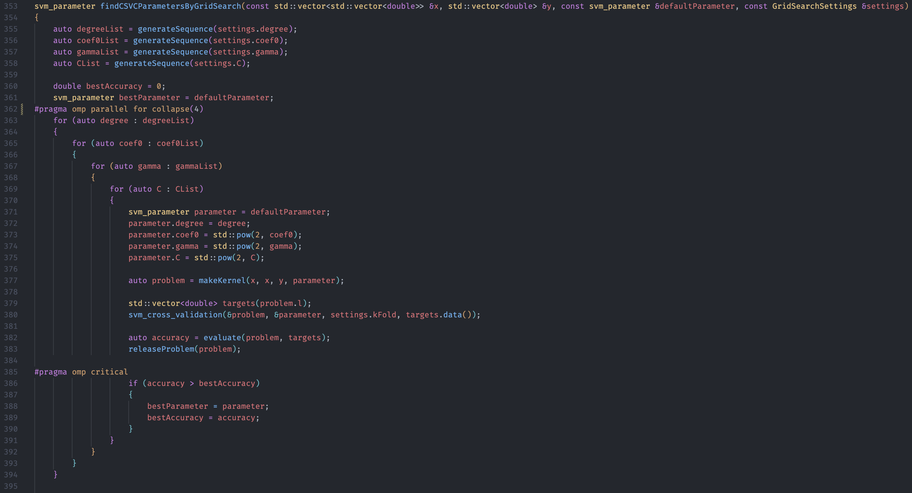
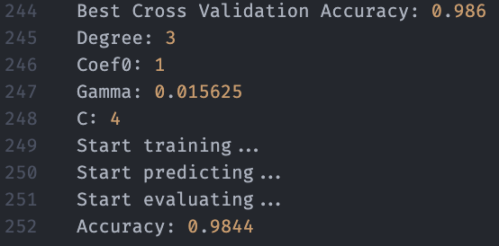

# Machine Learning Homework 5

[TOC]

## Environment

* OS

  

* Language: C++

* Standard: C++20

## Gaussian Process

### Code with detailed explanations

#### Libraries

Used library => Corresponding library in homework description

* Eigen => numpy
* OptimLib, autodiff => scipy.optimize
* Imgui, Implot => visualization
* Boost (for access file system only)
* OpenMP (for parallel acceleration)

#### Visualization

* **Setup**

  > Used to setup Imgui + OpenGL
  >
  > OpenGL is a backend for showing and drawing on window.

  

* **Draw result**

  > Arguments
  > 	title: plot title
  > 	data: training data points
  > 	f: line for Gaussian Process Regression with variance, f[0]: x, f[1]: y from means of conditional predictive distribution
  >
  > Setup Axes
  > ```C++
  > ImPlot::SetupAxes("x", "y");
  > // set x-axis range
  > ImPlot::SetupAxisLimits(ImAxis_X1, -60, 60);
  > ```
  >
  > Plot training data points
  > ````C++
  > // plot points with red color and circle
  > ImPlot::SetNextMarkerStyle(ImPlotMarker_Circle, IMPLOT_AUTO, COLOR_RED, IMPLOT_AUTO, COLOR_RED);
  > ImPlot::PlotScatter("train data", data.col(0).data(), data.col(1).data(), data.rows());
  > ````
  >
  > Plot the line for Gaussian Process Regression
  >
  > ````C++
  > // 95% confidence interval == std * 2
  > VectorXd variance = 2 * f.col(2);
  > // calculate the lower bound and upper bound of y
  > VectorXd upperBound = f.col(1) + variance;
  > VectorXd lowerBound = f.col(1) - variance;
  > 
  > // plot shade filled with blue color
  > ImPlot::SetNextFillStyle(COLOR_BLUE, 0.5f);
  > // Equivalent to fill_between of matplotlib
  > ImPlot::PlotShaded("f(x)'s 95%% confidence", f.col(0).data(), upperBound.data(), lowerBound.data(), f.rows());
  > 
  > // plot line with black color
  > ImPlot::SetNextLineStyle(COLOR_BLACK);
  > ImPlot::PlotLine("f(x)'s mean", f.col(0).data(), f.col(1).data(), f.rows());
  > ````

  

* **Show GUI**

  > Main loop of Imgui
  >
  > Arguments
  > 	data: training data points
  > 	f: line for Gaussian Process Regression with variance, f[0]: x, f[1]: y from means of conditional predictive distribution
  > 	optimizedF: line for Optimized Gaussian Process Regression with variance, f[0]: x, f[1]: y from means of conditional predictive distribution

  

#### Part1

* **Rational quadratic kernel**

  * Formula

    $k(x, x') = \sigma^2 (1 + \frac{||x - x'||^{2}_{2}}{2 \alpha \ell^2})^{-\alpha}$

  * Main kernel function (without $diff = ||x - x'||^{2}_{2}$)

    > Arguments
    > 	diff: data of $||x - x'||^{2}_{2}$
    > 	kernelParameters: parameters of Rational quadratic kernel, $\sigma^2$, $\alpha$, $\ell$
    >
    > Part of formula
    > $k(x, x') = \sigma^2 (1 + \frac{diff}{2 \alpha \ell^2})^{-\alpha}$

    

  * Vector `lhs` -> Vector `rhs` kernel function

    > Arguments
    > 	lhs: vector $x$ with $n$ instances
    > 	rhs: vector $x'$ with $m$ instances
    > 	kernelParameters: parameters of Rational quadratic kernel, $\sigma^2$, $\alpha$, $\ell$
    >
    > Part of formula
    > $diff = ||\vec{x} - \vec{x}'||^{2}_{2}$

    

  * Vector `lhs` -> Scalar `rhs` kernel function

    > Arguments
    > 	lhs: vector $x$ with $n$ instances
    > 	rhs: scalar $x'$
    > 	kernelParameters: parameters of Rational quadratic kernel, $\sigma^2$, $\alpha$, $\ell$
    >
    > Part of formula
    > $diff = ||\vec{x} - x'||^{2}_{2}$

    

  * Scalar `lhs` -> Scalar `rhs` kernel function

    > Arguments
    > 	lhs: scalar $x$
    > 	rhs: scalar $x'$
    > 	kernelParameters: parameters of Rational quadratic kernel, $\sigma^2$, $\alpha$, $\ell$
    >
    > Part of formula (for convenience, create a vector contained one scalar)
    > $diff = ||x - x'||^{2}_{2}$

    

* **Gaussian Process Regression**

  * Formula

    * Training with RBF kernel
      $$
      p(\bold{y}|\theta) = \int_{}^{} p(\bold{y}|\bold{f}) p(\bold{f}) d\bold{f} = \mathcal{N}(\bold{y}|\bold{0},\bold{C_{\theta}}) \\\\
      
      \operatorname{C_{\theta}}(\bold{x_n}, \bold{x_m}) = k_{\theta}(\bold{x_n}, \bold{x_m}) + \beta^{-1} \delta_{nm} \\
      \operatorname{C_{\theta}}(\bold{x}, \bold{x}') = K_{\theta}(\bold{x}, \bold{x}') + \beta^{-1} \mathbf{I_n} \\\\
      
      k_{\theta}(\bold{x}, \bold{x}') = \theta_0 (1 + \frac{||\bold{x} - \bold{x}'||^{2}_{2}}{2 \theta_1 \theta_{2}^2})^{-\theta_1}
      $$
  
    * Prediction
      $$
      p(y^*|x^*, \bold{y}) = \mathcal{N}(y^*|\mu(\bold{x}^*), \sigma^2(\bold{x}^*)) \\\\
      \mu(\bold{x}^*) = k(\bold{x}, \bold{x}^*)^\top \bold{C}^{-1} \bold{y} \\
      \sigma^2(\bold{x}^*) = k(\bold{x}^*, \bold{x}^*) + \beta^{-1} - k(\bold{x}, \bold{x}^*)^\top \bold{C}^{-1} k(\bold{x}, \bold{x}^*)
      $$
  
  * Main function
  
    > Arguments
    > 	data: training data points
    > 	beta: hyperparameter for variance of error noise
    >
    > Check the comments in the figure to understand the whole procedure
  
    
  
  * `calculateCovariance` function: calculate covariance $\bold{C_{\theta}}$ of marginal distribution $p(\bold{y})$
  
    > Arguments
    > 	data: training data points
    > 	beta: hyperparameter for variance of error noise
    > 	kernelParameters: parameters of Rational quadratic kernel, $\sigma^2$, $\alpha$, $\ell$
    >
    > Formula
    > $$
    > \operatorname{C_{\theta}}(\bold{x}, \bold{x}') = K_{\theta}(\bold{x}, \bold{x}') + \beta^{-1} \mathbf{I_n}
    > $$
    > 
  
    
  
  * `generatePointsOfLine` function: sample data points from predictive distribution $p(y^*|\bold{y})$
  
    > Formula
    > $$
    > p(y^*|x^*, \bold{y}) = \mathcal{N}(y^*|\mu(\bold{x}^*), \sigma^2(\bold{x}^*)) \\\\
    > \mu(\bold{x}^*) = k(\bold{x}, \bold{x}^*)^\top \bold{C}^{-1} \bold{y} \\
    > \sigma^2(\bold{x}^*) = k(\bold{x}^*, \bold{x}^*) + \beta^{-1} - k(\bold{x}, \bold{x}^*)^\top \bold{C}^{-1} k(\bold{x}, \bold{x}^*)
    > $$
    > Note: $k(\bold{x}, \bold{x}^*)^\top \bold{C}^{-1}$ is a common part.
  
    

#### Part2

* Main function (check the red rectangle)

  > Arguments
  > 	data: training data points
  > 	beta: hyperparameter for variance of error noise
  >
  > Check the comments in the figure to understand the whole procedure

  

* `evaluateOptimFn` function: calculate the gradients by using autodiff library

  > Arguments
  > 	parameters: parameters of Rational quadratic kernel, $\sigma^2$, $\alpha$, $\ell$
  > 	grad_out: used to store the gradients
  > 	args: external data

  

* `calculateLoss` function: calculate the loss value by negative log marginal likelihood

  > Arguments
  > 	parameters: parameters of Rational quadratic kernel, $\sigma^2$, $\alpha$, $\ell$
  > 	data: training data points
  > 	beta: hyperparameter for variance of error noise
  >
  > Formula
  > $$
  > \ln p(\bold{y}|\theta) = \frac{1}{2} \ln \det \bold{C_\theta} + \frac{1}{2} \bold{y}^\top \bold{C_\theta}^{-1} \bold{y} + \frac{N}{2} \ln (2 \pi)
  > $$
  > 

  

### Experiments settings and results

#### Settings

* $\beta$: 5

#### Result

* Optimized parameters

  

* Figure

  

### Observations and discussion

* Before optimizing the kernel parameters of RBF function
  * the variance for each $x$ is unstable.
  * some training data points are not fitted well, especially in the edge of curve.
* After optimizing the kernel parameters of RBF function
  * the problems above are relieved.
  * but the variances in intervals which do not have training data points are super large.
    * It is quite reasonable because we rely on kernel function to calculate the similarity between training data and $x$.
* If we adjust hyperparameter $\beta$, what it will happen.

## SVM

### Code with detailed explanations

#### Libraries

* LIBSVM
* Boost (for access file system only)
* OpenMP (for parallel acceleration)

#### Part1

* **Kernel functions**

  * Linear
    $$
    k(\bold{x}, \bold{x}') = \bold{x} \bold{x}'^\top
    $$

  * RBF
    $$
    k(\bold{x}, \bold{x}') = \exp^{-\gamma ||\bold{x} - \bold{x}'||^2_2}
    $$

  * Polynomial
    $$
    k(\bold{x}, \bold{x}') = (\gamma \bold{x} \bold{x}'^\top + coef0)^{degree}
    $$

* Entrypoint

  

* `makeProblem` function: convert data into `struct svm_problem` format

  >Arguments
  >	x: data features
  >	y: data labels
  >
  >LIBSVM data structures
  >
  >```c++
  >For example, if we have the following training data:
  >
  >    LABEL    ATTR1    ATTR2    ATTR3    ATTR4    ATTR5
  >    -----    -----    -----    -----    -----    -----
  >      1        0        0.1      0.2      0        0
  >      2        0        0.1      0.3     -1.2      0
  >      1        0.4      0        0        0        0
  >      2        0        0.1      0        1.4      0.5
  >      3       -0.1     -0.2      0.1      1.1      0.1
  >
  >    then the components of svm_problem are:
  >
  >    l = 5
  >
  >    y -> 1 2 1 2 3
  >
  >    x -> [ ] -> (2,0.1) (3,0.2) (-1,?)
  >         [ ] -> (2,0.1) (3,0.3) (4,-1.2) (-1,?)
  >         [ ] -> (1,0.4) (-1,?)
  >         [ ] -> (2,0.1) (4,1.4) (5,0.5) (-1,?)
  >         [ ] -> (1,-0.1) (2,-0.2) (3,0.1) (4,1.1) (5,0.1) (-1,?)
  >
  >where (index,value) is stored in the structure svm_node
  >*index = -1 indicates the end of one vector. Note that indices must be in ASCENDING order.
  >
  >struct svm_node
  >{
  >	int index;
  >	double value;
  >};
  >
  >struct svm_problem
  >{
  >	int l;
  >	double *y;
  >	struct svm_node **x;
  >};
  >```

  

* `solvePart1` function: main function of Part 1

  > Arguments
  > 	trainProblem: training data represented by `struct svm_problem`
  > 	testProblem: test data represented by `struct svm_problem`
  > 	numberOfFeatures: number of pixels for each row (image)

  

* `createSVMParameter` function: create a default `struct svm_parameter` structure

  > LIBSVM data structure
  >
  > ```C++
  > enum { C_SVC, NU_SVC, ONE_CLASS, EPSILON_SVR, NU_SVR };	/* svm_type */
  > enum { LINEAR, POLY, RBF, SIGMOID, PRECOMPUTED }; /* kernel_type */
  > 
  > struct svm_parameter
  > {
  > 	int svm_type;
  > 	int kernel_type;
  > 	int degree;	/* for poly */
  > 	double gamma;	/* for poly/rbf/sigmoid */
  > 	double coef0;	/* for poly/sigmoid */
  > 
  > 	/* these are for training only */
  > 	double cache_size; /* in MB */
  > 	double eps;	/* stopping criteria */
  > 	double C;	/* for C_SVC, EPSILON_SVR and NU_SVR */
  > 	int nr_weight;		/* for C_SVC */
  > 	int *weight_label;	/* for C_SVC */
  > 	double* weight;		/* for C_SVC */
  > 	double nu;	/* for NU_SVC, ONE_CLASS, and NU_SVR */
  > 	double p;	/* for EPSILON_SVR */
  > 	int shrinking;	/* use the shrinking heuristics */
  > 	int probability; /* do probability estimates */
  > };
  > ```
  >
  > The initial value is copied from their svm program, named `svm-train.c`.
  >
  > We only focus on `kernel_type`, `C`, `gamma` (poly/RBF), `degree` (poly), `coef0` (poly).

  

* `train_evaluate` function: train the SVM by training data & evaluate the performance by test data

  > Arguments
  > 	trainProblem: training data represented by `struct svm_problem`
  > 	testProblem: test data represented by `struct svm_problem`
  > 	parameter: SVM parameters

  

* `train` function: train the SVM by training data & get the trained model

  

* `predict` function: predict the test data by the trained model

  

* `evaluate` function: evaluate the accuracy between predictions and ground truths.

  

#### Part2

* Entrypoint

  

* `solvePart2` function: main function of Part 2

  > Arguments
  > 	trainProblem: training data represented by `struct svm_problem`
  > 	testProblem: test data represented by `struct svm_problem`
  > 	numberOfFeatures: number of pixels for each row (image)
  >
  > Data structure for grid search
  >
  > ```C++
  > template <typename T>
  > struct GridSearchRange
  > {
  >     T start = -1;
  >     T end = -1;
  >     T step = 1;
  > };
  > 
  > struct GridSearchSettings
  > {
  >     /* for poly */
  >     GridSearchRange<int> degree;
  >     GridSearchRange<double> coef0;
  > 
  >     /* for poly/rbf */
  >     GridSearchRange<double> gamma;
  > 
  >     /* for C_SVC */
  >     GridSearchRange<double> C;
  > 
  >     int kFold = 3;
  > };
  > ```

  

* `findCSVCParametersByGridSearch` function: perform grid search & find the best parameters by cross-validation

  > Arguments
  > 	problem: training data represented by `struct svm_problem`
  > 	defaultParameter: original SVM parameter
  > 	settings: settings for grid search
  >
  > We only focus on `C`, `gamma` (poly/RBF), `degree` (poly), `coef0` (poly).

  

  

#### Part3

* Custom kernel function (RBF + Linear kernel)
  $$
  k(\bold{x}, \bold{x}') = \bold{x} \bold{x}'^\top + \exp^{-\gamma ||\bold{x} - \bold{x}'||^2_2}
  $$

* Entrypoint

  

* `solvePart3` function: main function of Part 3

  > Arguments
  > 	trainX: x of training data, shape [N, pixels] 
  > 	trainY: y of training data, shape [N]
  > 	testX: y of test data, shape [N, pixels]
  > 	testY: y of test data, shape [N]
  > 	numberOfFeatures: number of pixels for each row (image)

  

* `makeKernel` function: calculate precomputed kernel values with custom kernel function $k(\bold{x}, \bold{x}')$ & convert data into `struct svm_problem` format

  > Arguments
  > 	x1: x, shape [N, pixels] 
  > 	x2: x', shape [N]
  > 	y: y, shape [N]
  > 	parameter: SVM parameter

  

* `calculateKernel` function: calculate kernel value with custom kernel function (RBF + Linear kernel)

  > Arguments
  > 	x1: x, shape [N, pixels] 
  > 	x2: x', shape [N]
  > 	parameter: SVM parameter
  >
  > Formula
  > $$
  > k(\bold{x}, \bold{x}') = \bold{x} \bold{x}'^\top + \exp^{-\gamma ||\bold{x} - \bold{x}'||^2_2}
  > $$

  

* `findCSVCParametersByGridSearch` function: perform grid search & find the best parameters by cross-validation with custom kernel function

  > Arguments
  > 	x: x of training data, shape [N, pixels] 
  > 	y: y of training data, shape [N]
  > 	defaultParameter: original SVM parameter
  > 	settings: settings for grid search
  >
  > We only focus on `C`, `gamma` (RBF).
  >
  > Once we choose a set of SVM parameter, we have to recalculate the precomputed kernel.

  

### Experiments settings and results

#### Default Settings


#### Part1

> Settings: only change the kernel type to the corresponding kernel.


#### Part2

> Grid Search settings: `coef0`, `gamma`, `C` are exponential terms based on 2.
>
> 

* Linear model

  > Accuracy of test data is 0.96.

  

* Polynomial model

  > Accuracy of test data is 0.96.

* RBF model

  > Accuracy of test data is 0.96.

#### Part3

> RBF + Linear kernel
>
> Grid Search settings: `gamma`, `C` are exponential terms based on 2. (ignore `degree`, `coef0`)
>
> 
>
> Accuracy of test data is 0.9604.


### Observations and discussion

* Custom kernel function comparisons

  > Grid Search settings: only change `gamma` and `C`
  >
  > Highest accuracy: 0.9844
  >
  > RBF * Linear kernel & RBF * Poly kernel
  >
  > 
  >
  > The difference of these two kernels are `C` cost parameter.
  >
  > `gamma` parameter is same.

  * RBF + Linear kernel

    

  * RBF * Linear kernel

    

  * Linear + Poly kernel
  
    
  
  * Linear * Poly kernel
  
    
  
  * RBF + Poly kernel
  
    
  
  * RBF * Poly kernel
  
    