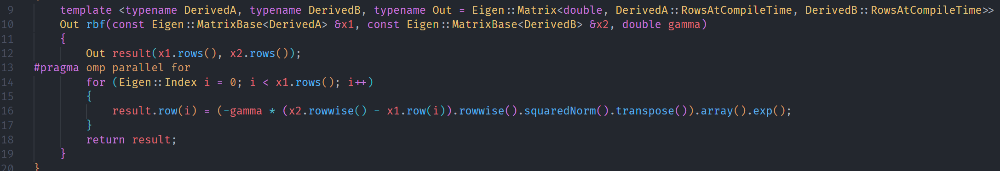

# Machine Learning Homework 6

[TOC]

## Environment

* Language: C++

* Standard: C++20

## Code with detailed explanations

### Libraries

Used library => Corresponding library in homework description

* Eigen => numpy
* OpenCV => visualization
* Boost (for access file system only)
* OpenMP (for parallel acceleration)

### Visualization

* **Main part**

  > Use `fittingHistory` which records the labels for every iterations to make a video.
  >
  > The duration of one iteration is 1s.
  >
  > 
  >
  > `cv::addWeighted` function is used to combine the clustering results (segmentation mask) with original image. 
  >
  > `drawMask` function is used to convert the labels to segmentation mask.

  

* **Draw mask**

  > Convert the labels to segmentation mask.
  >
  > 
  >
  > `labels` contains the clustering results, from 0 to k-1.
  >
  > `cv::applyColorMap` is used to map the labels to the corresponding color to avoid duplicate colors.

  

### Part1

* **Kernel K-Means**

  * Pseudo-code

    > Ignore weight

    

  * Main function

    > Arguments
    > 	path: the image data folder
    > 	numberOfClusters: the number of clusters
    > 	init: the selected initialization method, random or k-means++
    > 	gamma1, gamma2: the hyper-parameter of RBF kernel

    

  * `kmeans.h` header: k-means related classes

    > Follow the scikit-learn logic design.

    

  * `KernelKMeans` constructor

    

    

  * `preprocess` function: extract RGB values and coordinates

    > Arguments
    > 	image: (H, W, 3), BGR values

    

  * `calculateKernel` function: calculate all kernel values

    > Arguments
    > 	pixels: (N, 3), RGB values
    > 	coordinates: (N, 2), coordinates
    > 	gamma1: $\gamma_c$ scalar
    > 	gamma2: $\gamma_s$ scalar
    >
    > Formula
    >
    > 
    >
    > $S(x)$ is the spatial information (coordinate)
    >
    > $C(x)$ is the color information (RGB)

    

  * `rbf` function: RBF kernel

    > Arguments
    > 	x1: $x$ vector
    > 	x2: $x'$ vector
    > 	gamma: $\gamma$ scalar
    >
    > Formula
    >
    > $k(x, x') = e^{-\gamma||x - x'||^2}$

    

  * `kernelKMeans.fit` function: fit the data

    > Previously, we already calculated the kernel first.
    >
    > So, we use the precomputed kernel values directly.
    >
    > Arguments
    > 	x: (N, N), the kernel values (gram matrix, similarity matrix)
    >
    > Steps
    >
    > 1. Pick k centers
    > 2. Calculate the cost between the data and centers
    > 3. Assign the label which has the smallest distance to the data
    > 4. Keep repeating 2, 3 step until the labels are not changed
    >
    > `fittingHistory` is used to store the labels for every iterations.
    >
    > Note: At the line 183, we do $1 - x$ to get the distance matrix.

    

  * `initializeCenters` function: pick k centers initialized by the selected method

    > Arguments
    > 	x: (N, N) precomputed distance matrix or (N, features) data
    > 	init: the selected initialization method, random or k-means++
    > 	seed: the random seed
    > 	precomputed: x is the precomputed distance matrix or not.

    

  * `randomInitialization` function: randomly pick k centers

    > Arguments
    > 	x: (N, N) precomputed distance matrix or (N, features) data
    > 	numberOfClusters: k clusters
    > 	seed: the random seed
    >
    > Steps
    >
    > 1. generate the sequence of indexes, 0 ~ N-1
    > 2. shuffle the sequence
    > 3. pick the top k rows as the centers

    

  * `assignLabels` function: calculate the cost and assign labels

    > Arguments
    > 	x: (N, N), the kernel values
    >
    > Steps
    >
    > 1. Calculate the cost between the data and centers
    >
    >    
    >
    > 2. Assign the label which has the smallest distance to the data

    

* **Spectral Clustering**

  * 

### Part2

> Use command to control the number of clusters and other parameters.

### Part3

* **Kernel K-Means**: K-Means++ initialization

  > Arguments
  > 	x: (N, N) precomputed distance matrix or (N, features) data
  > 	numberOfClusters: k clusters
  > 	seed: the random seed
  >
  > Steps
  >
  > 	1. Choose one center uniformly at random among the data points.
  > 	1. For each data point x not chosen yet, compute $D(x)^2$ (the squared Euclidean distance) or use the precomputed distance matrix, the distance between x and the nearest center that has already been chosen.
  > 	1. Choose one new data point at random as a new center, using a weighted probability distribution where a point x is chosen with probability proportional to $D(x)^2$. (The farthest point will be chosen.)

  

* **Spectral Clustering**

### Part4

## Experiments settings and results & Discussion

### Part1

* **Kernel K-Means**

  > Number of clusters: 2
  >
  > Initialization method: random
  >
  > Gamma1: 0.00001
  >
  > Gamma2: 0.00001

  * image1

    * [Video](https://leafying.synology.me:8001/d/s/tlJkVjJWaNRni2U9GBLm3VRMXvfcJB3q/NzfL4IBDXvPyas-UnzDD3upk9nOfJ_Dy-RLhAOcHXeQo)

    * Final

      

    * Mask

      

  * image2

    * [Video](https://leafying.synology.me:8001/d/s/tlJkV5I5EqW1G59E7RqSwnnMkDmmiOza/W82E22WX3M1DqvFoV5M-D-Rj_c3v-vIy-cLgA2unXeQo)
    * Final

    

    * Mask

    

* **Spectral Clustering**

### Part2

* **Kernel K-Means**

  > Initialization method: random
  >
  > Gamma1: 0.00001
  >
  > Gamma2: 0.00001

  * K = 3，image1

    * [Video](https://leafying.synology.me:8001/d/s/tlK2IhHPTDMoZAn2Px61kBUeD6hmG2JT/ETDRZkCVd_Z3WdlKjP8OJRMGQM-uPBxW-Mbngxm_YeQo)

    * Final

      

    * Mask

      

  * K = 3，image2

    * [Video](https://leafying.synology.me:8001/d/s/tlK2IHsJK6GDrK3FPvgBQQe6hbEPTSN3/EyH7Ylc8YKtmtrpxL7kzsZfh1L-NjJ2j-S7lAuXjYeQo)

    * Final

      

    * Mask

      

  * K = 4，image1

    * [Video](https://leafying.synology.me:8001/d/s/tlKDRkjAYAz9zubq5Xe1R40IA80v4N1K/WPSMmA6YA1bWgxkvl0aaLd3WO2-XRnxs-CLpATxTZeQo)

    * Final

      

    * Mask

      

  * K = 4，image2

    * [Video](https://leafying.synology.me:8001/d/s/tlKDRYNcOEHJFozynh1pQvKgTj9Meg1f/iswTOVNZzI4pVDsUli7_IzAYmx9rUylI-IrogKBzZeQo)

      

    * Final

      

    * Mask

      

* **Spectral Clustering**

### Part3

* **Kernel K-Means**

  I think there is no significant difference between random and k-means++.

  > Initialization method: k-means++
  >
  > Gamma1: 0.00001
  >
  > Gamma2: 0.00001

  * K = 2，image1

    * [Video](https://leafying.synology.me:8001/d/s/tlKRiZFb0gx4l9kDflaP7klb7aBSWAaF/L-hBJP7wwnJB61EqCAn2QoJuZcszh4DU-V7zgnwjbeQo)

    * Final

      

    * Mask

      

  * K = 2，image2

    * [Video](https://leafying.synology.me:8001/d/s/tlKRi2bj2wFEx7MHf7L7c0aY1hxN45pI/aa6FQXex-EHP1JC5vAeVsalZBklWmpcJ-eLwAhCLbeQo)

    * Final

      

    * Mask

      

  * K = 3，image1

    * [Video](https://leafying.synology.me:8001/d/s/tlKZr1qvG4ov4mDU315jSPmwJvjGdcT1/OUn_fQuKd6ZV7ZXSQ79pOWPgu26L5Wew-Bb1gKRHceQo)

    * Final

      

    * Mask

      

  * K = 3，image2

    * [Video](https://leafying.synology.me:8001/d/s/tlKZqYtpzEq77o7rFST7oy2twnltK81y/9VVb0XfNRIntOwWx5em7LTGGIC7CrFwD-Hr2gqxjceQo)

    * Final

      

    * Mask

      

  * K = 4，image1

    * [Video](https://leafying.synology.me:8001/d/s/tlKrFasoosdXs3yXmmjXxz7aCiwdKt3x/jo9xz996PqUXZbHKei9UE9MswtxtDSMh-W70AkTHceQo)

    * Final

      

    * Mask

      

  * K = 4，image2

    * [Video](https://leafying.synology.me:8001/d/s/tlKrGL9R1pJrtQt7mPhl2B5O2515Bl8p/b_aZCx7aSNm5UDUgm5jsejmxaMyX1ATz-dL2gyzfceQo)

    * Final

      

    * Mask

      

* **Spectral Clustering**

### Part4

## Observations and discussion

* Coming soon...
  
