# Machine Learning Homework 7

[TOC]

## Environment

* Language: Python

* Version: 3.9.16

## Code with detailed explanations

### Kernel Eigenfaces

#### Part1

* Algorithms

  * PCA

    1. Calculate covariance matrix of data $X$ (D by D matrix)

       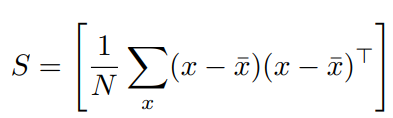

    2. According to *Rayleigh quotient*,
       we could use eigen decomposition on covariance matrix of data to get the first k largest eigenvectors (principal components) as $W$ orthogonal projection matrix

       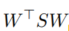

    3. Project the data onto low dimensional space

       $Z = XW$

    4. Reconstruct the data (lossless if # of eigenvectors = D)

       $X = ZW^T$

  * LDA

    1. Within-class scatter $S_W$

       $\bold{m}_j = \dfrac{1}{n_j} \sum_{i \in C_j} x_i$

       $S_W = \sum_{j=1}^k \sum_{i \in C_j} (x_i - \bold{m}_j) (x_i - \bold{m}_j)^T$

    2. Between-class scatter $S_B$

       $\bold{m} = \dfrac{1}{n} \sum x$

       $S_B = \sum_{j=1}^k (\bold{m}_j - \bold{m}) (\bold{m}_j - \bold{m})^T$

    3. According to the objective function $J(W) = \dfrac{\det(W^TS_BW)}{\det(W^TS_WW)}$ and *Rayleigh quotient*,
       we could formulate it to

       $S_Bw_l = \lambda_lS_Ww_l$

       $S^{-1}_WS_Bw_l = \lambda_lw_l$

    4. Use eigen decomposition on $S^{-1}_WS_B$ to get the first k largest eigenvectors (principal components) as $W$ orthogonal projection matrix

    5. Project the data onto low dimensional space

       $Z = XW$

    6. Reconstruct the data (lossless if # of eigenvectors = D)

       $X = ZW^T$

* `utils.load_data` function: Load data from PGM files

  > Arguments
  > 	files: list of files, contains PGM files
  >
  > Steps
  >
  > 1. Load the image
  > 2. Center crop image to squared shape
  > 3. Resize the cropped image to 40 by 40 (need less computation resources)
  > 4. Scale it from [0, 255] to [0, 1]

  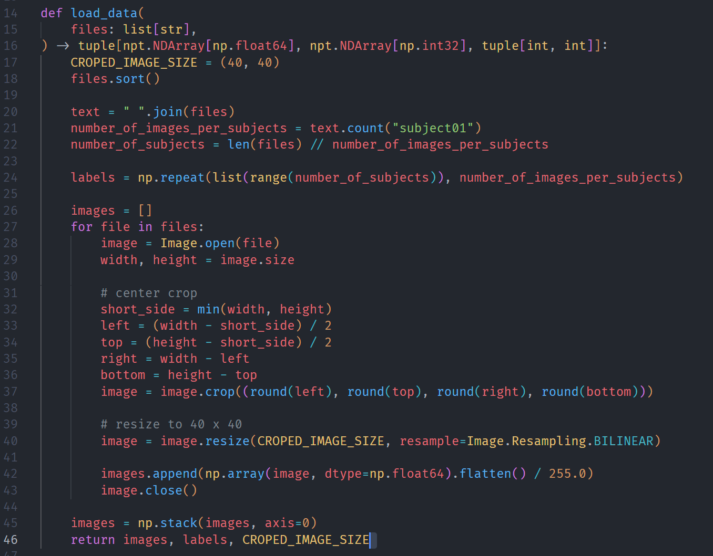

* `train.py` main: program entry point

  > In Part1, we only focus on normal PCA and LDA.
  >
  > 
  >
  > Here, the covariance matrix calculation (`np.cov`) corresponds to the first step of PCA.
  >
  > PCA: Calculate covariance matrix of data $X$ (D by D matrix)
  >
  > 

  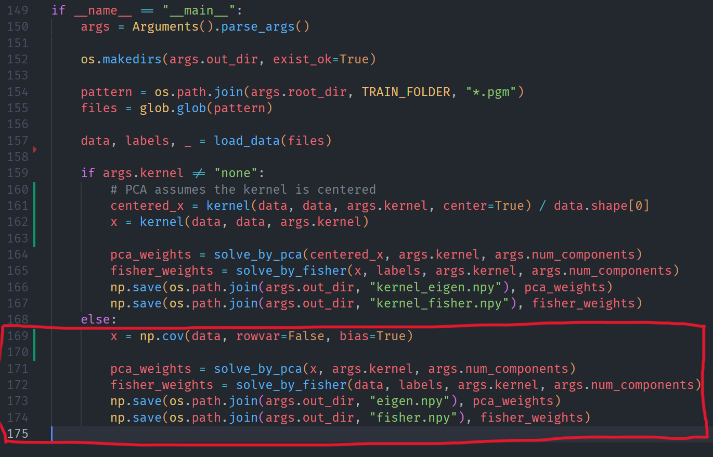

* `train.solve_by_pca` function: use PCA algorithm to find $W$ orthogonal projection matrix

  > Arguments
  > 	x: np.ndarray, covariance matrix of data $X$
  > 	kernel_type: ignored
  > 	num_components: keep first k principal components
  >
  > In Part1, we only focus on normal PCA.
  >
  > 
  >
  > Here, it is the second step of PCA.
  >
  > According to *Rayleigh quotient*,
  > we could use eigen decomposition on covariance matrix of data to get the first k largest eigenvectors (principal components) as $W$ orthogonal projection matrix
  >
  > 

  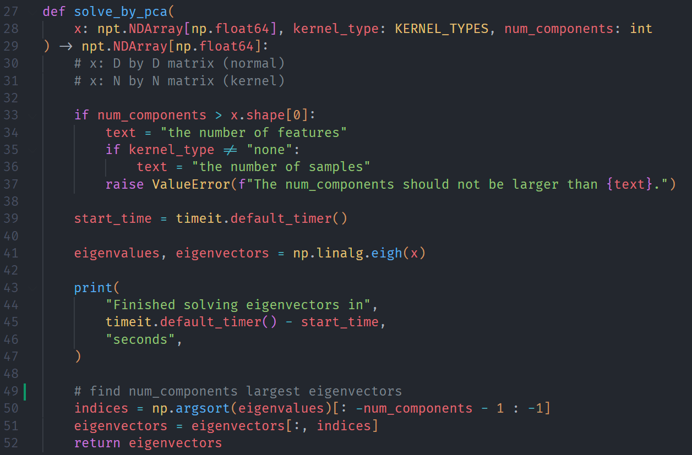

* `train.calculate_between_and_with_class_covariance` function: calculate between-class and within-class covariance

  > Arguments
  > 	x: np.ndarray, features of data $X$
  > 	labels: np.ndarray, gt labels of data $X$
  > 	kernel_type: ignored
  > 	num_components: keep first k principal components
  >
  > In Part1, we only focus on normal LDA.
  >
  > 
  >
  > Here, it corresponds to the first and second step of LDA.
  >
  > 1. Within-class scatter $S_W$
  >
  >    $\bold{m}_j = \dfrac{1}{n_j} \sum_{i \in C_j} x_i$
  >
  >    $S_W = \sum_{j=1}^k \sum_{i \in C_j} (x_i - \bold{m}_j) (x_i - \bold{m}_j)^T$
  >
  > 2. Between-class scatter $S_B$
  >
  >    $\bold{m} = \dfrac{1}{n} \sum x$
  >
  >    $S_B = \sum_{j=1}^k (\bold{m}_j - \bold{m}) (\bold{m}_j - \bold{m})^T$

  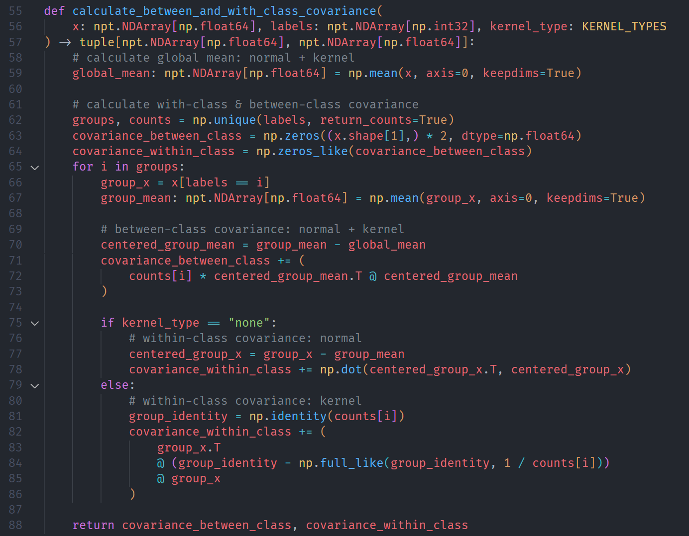

* `train.solve_by_fisher` function: use LDA algorithm to find $W$ orthogonal projection matrix

  > Arguments
  > 	x: np.ndarray, covariance matrix of data $X$
  > 	labels: np.ndarray, gt labels of data $X$
  > 	kernel_type: ignored
  > 	num_components: keep first k principal components
  >
  > In Part1, we only focus on normal LDA.
  >
  > 
  >
  > After calculating the between-class and within-class covariance,
  >
  > use eigen decomposition on $S^{-1}_WS_B$ to get the first k largest eigenvectors (principal components) as $W$ orthogonal projection matrix.
  >
  > $S^{-1}_WS_Bw_l = \lambda_lw_l$

  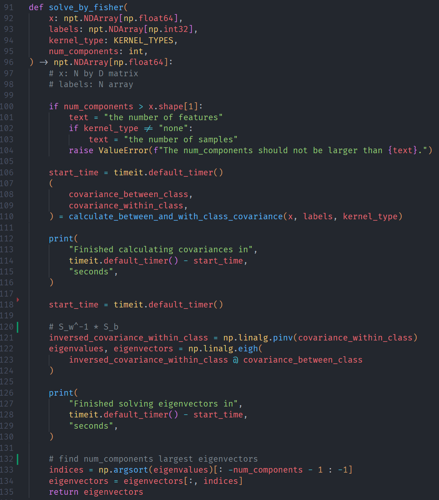

* `test.py` main: program entry point

  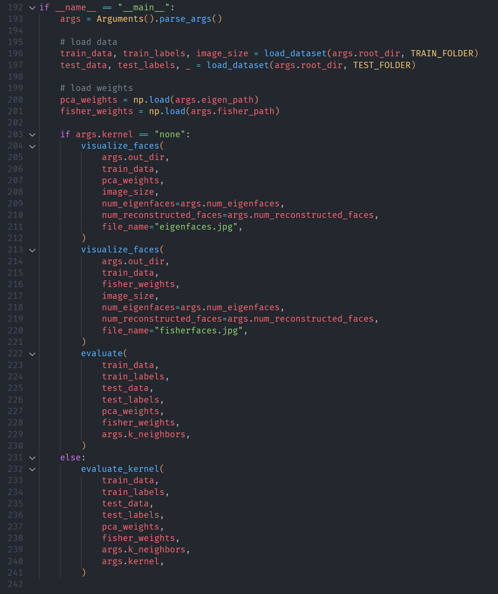

* `utils.plot_faces` function: plot faces on image grid and export image

  > Arguments
  > 	file_name: str, image file name
  > 	samples: np.ndarray, faces
  > 	cols_per_row: int, used for plot image grid

  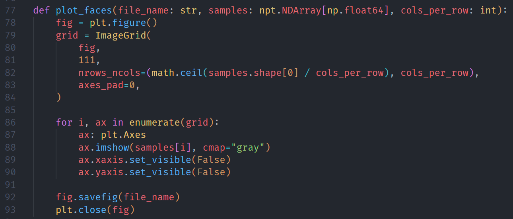

* `test.visualize_faces` function: visualize eigenfaces, fisherfaces and reconstructed faces

  > Arguments
  > 	out_dir: str, output folder path
  > 	samples: np.ndarray, shape (N, D), data samples
  > 	weights: PCA or LDA weights, shape (D, E)
  > 	image_size: tuple[int, int], (width, height), data image size
  > 	file_name: str, base output file name
  > 	num_eigenfaces: int, how many eigenfaces need to be visualized
  > 	num_reconstructed_faces: int, how many faces need to be reconstructed
  > 	cols_per_row: int, used for plot image grid
  >
  > 
  >
  > After plot the eigenfaces,
  >
  > we reconstruct faces by the formula $X = XWW^T$.

  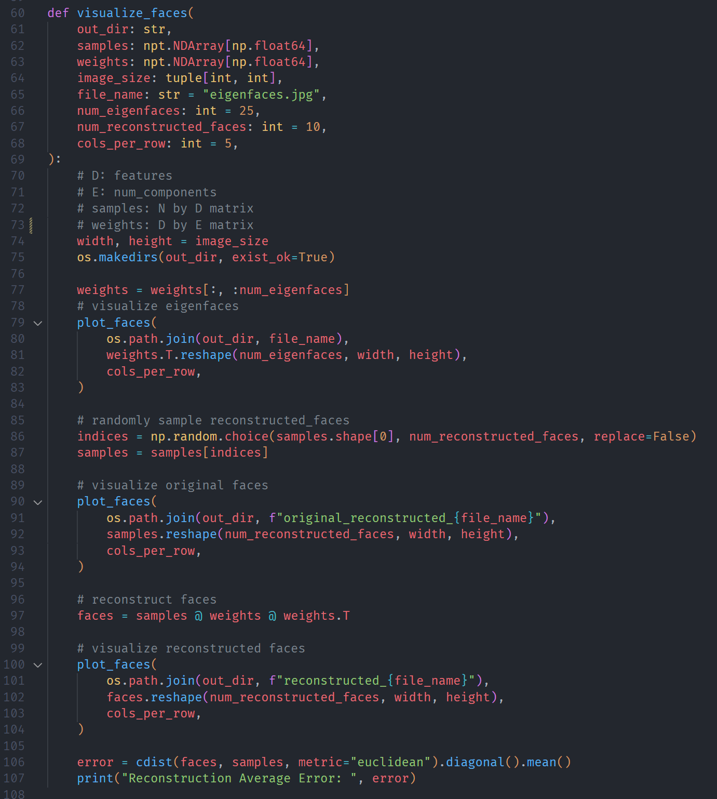

#### Part2

* `test.evaluate` function: evaluate performance by K-NN algorithm on PCA/LDA features

  > Arguments
  > 	train_data: np.ndarray, shape (N, D), train data samples
  > 	train_labels: np.ndarray, shape (N,), train data labels
  > 	test_data: np.ndarray, shape (N, D), test data samples
  > 	test_labels: np.ndarray, shape (N,), test data labels
  > 	pca_weights: PCA weights, shape (D, E)
  > 	fisher_weights: LDA weights, shape (D, E)
  > 	k_neighbors: int, k-NN

  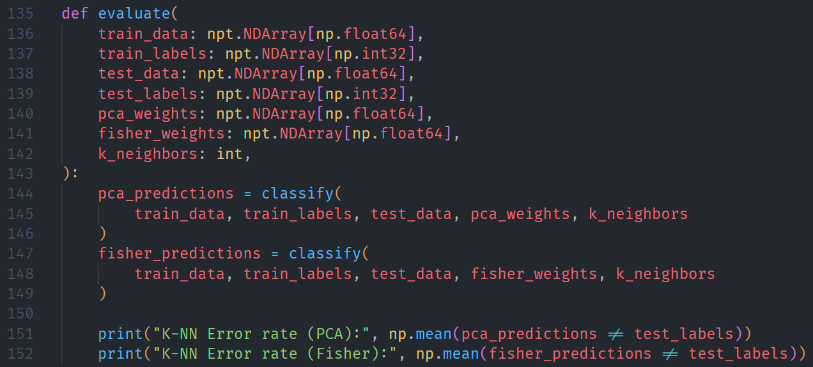

* `test.classify` function: use K-NN algorithm to classify images

  > Arguments
  > 	train_data: np.ndarray, shape (N, D), train data samples
  > 	train_labels: np.ndarray, shape (N,), train data labels
  > 	test_data: np.ndarray, shape (N, D), test data samples
  > 	weights: PCA or LDA weights, shape (D, E)
  > 	k_neighbors: int, k-NN
  >
  > 
  >
  > To project the data onto low dimensional space,
  >
  > $Z = XW$
  
  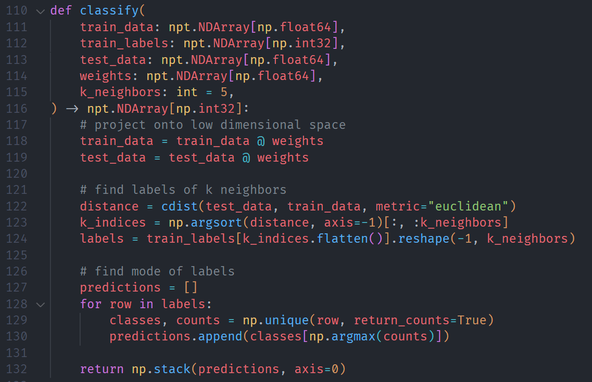

#### Part3

* Algorithms

  * Kernel PCA

    1. Calculate Kernel matrix of data $X$ (N by N matrix), RBF/Linear/Poly

    2. Centered Kernel matrix

       $K^C = K - 1_NK - K1_N + 1_NK1_N$

    3. According to the normal PCA eigenvalue problem in feature space,
       we could use eigen decomposition on centered Kernel matrix to get the first k largest eigenvectors (principal components) as $A$ matrix

       $Ka = \lambda Na$

       $\dfrac{1}{N}Ka = \lambda a$

    4. Project the data onto low dimensional space

       $Z = K(X_{new}, X)A$

  * Kernel LDA

    1. Calculate Kernel matrix of data $X$ (N by N matrix), RBF/Linear/Poly

    2. Within-class scatter $\bold{S}_W$

       $\bold{M}_j = \dfrac{1}{N_j} \sum_{k \in C_j} k(x_k, x_i), i \in N$

       $\bold{S}_W = \sum_{j=1}^k K_j (I - 1_{n_j}) K_j^T$

    3. Between-class scatter $\bold{S}_B$

       $\bold{M} = \dfrac{1}{N} \sum_{k \in N} k(x_k, x_i), i \in N$

       $\bold{S}_B = \sum_{j=1}^k N_j (\bold{M}_j - \bold{M}) (\bold{M}_j - \bold{M})^T$

    4. Use eigen decomposition on $\bold{S}^{-1}_W\bold{S}_B$ to get the first k largest eigenvectors (principal components) as $A$ matrix

    5. Project the data onto low dimensional space

       $Z = K(X_{new}, X)A$

* `utils.kernel` function: calculate Kernel matrix

  > Arguments
  > 	x: np.ndarray, shape (N, D), a set of data
  > 	y: np.ndarray, shape (N, D), another set of data
  > 	kernel_type: Literal["rbf", "linear", "poly"], choose a Kernel to calculate Kernel matrix
  > 	center: center it after calculating Kernel matrix
  >
  > 
  >
  > To center the kernel, we could use this formula.
  >
  > $K^C = K - 1_NK - K1_N + 1_NK1_N$

  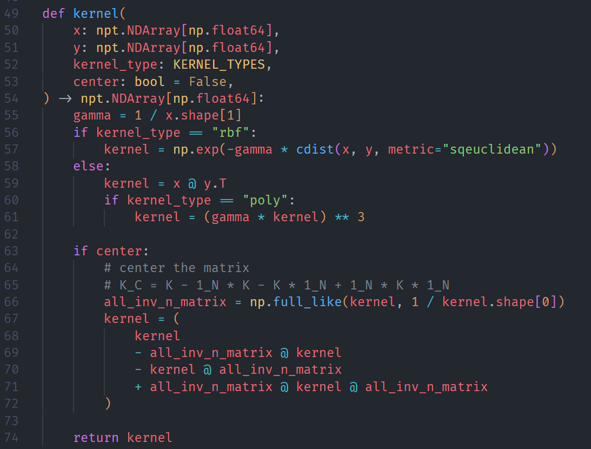

* `train.py` main

  > In Part3, we focus on Kernel PCA and LDA.
  >
  > 
  >
  > Kernel PCA assumes the Kernel is centered.
  >
  > So, before doing eigen decomposition, we have to calculate the Kernel first, then doing dimensional reduction.
  >
  > 
  >
  > Before going to the function, we also need to multiply the inverse of number of data.
  >
  > $\dfrac{1}{N}K$

  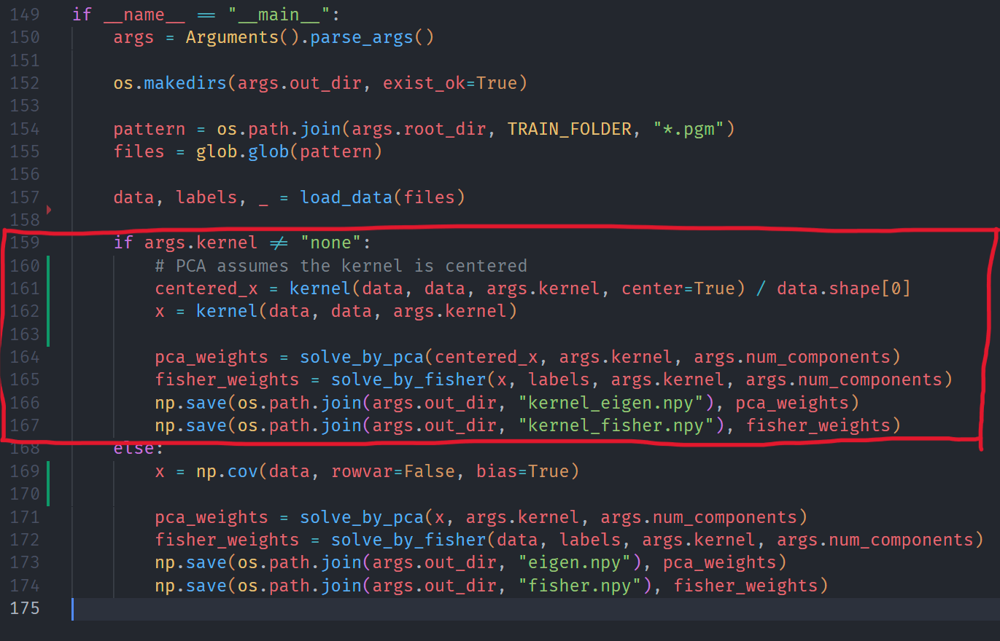

* `train.solve_by_pca` function: use Kernel PCA algorithm to find $A$ orthogonal projection matrix

  > Arguments
  > 	x: np.ndarray, Kernel matrix of data $X$
  > 	kernel_type: Literal["rbf", "linear", "poly"], used for checking some requirements
  > 	num_components: keep first k principal components
  >
  > In Part3, we only focus on Kernel PCA.
  >
  > 
  >
  > According to the normal PCA eigenvalue problem in feature space,
  > we could use eigen decomposition on centered Kernel matrix to get the first k largest eigenvectors (principal components) as $A$ matrix
  >
  > $Ka = \lambda Na$
  >
  > $\dfrac{1}{N}Ka = \lambda a$

  

* `train.calculate_between_and_with_class_covariance` function: calculate between-class and within-class kernel covariance

  > Arguments
  > 	x: np.ndarray, Kernel matrix of data $X$
  > 	labels: np.ndarray, gt labels of data $X$
  > 	kernel_type: Literal["rbf", "linear", "poly"], used for checking some conditions
  > 	num_components: keep first k principal components
  >
  > In Part3, we only focus on Kernel LDA.
  >
  > 
  >
  > Here, it corresponds to the second and third step of Kernel LDA.
  >
  > 1. Within-class scatter $\bold{S}_W$
  >
  >    $\bold{M}_j = \dfrac{1}{N_j} \sum_{k \in C_j} k(x_k, x_i), i \in N$
  >
  >    $\bold{S}_W = \sum_{j=1}^k K_j (I - 1_{n_j}) K_j^T$
  >
  > 2. Between-class scatter $\bold{S}_B$
  >
  >    $\bold{M} = \dfrac{1}{N} \sum_{k \in N} k(x_k, x_i), i \in N$
  >
  >    $\bold{S}_B = \sum_{j=1}^k N_j (\bold{M}_j - \bold{M}) (\bold{M}_j - \bold{M})^T$

  

* `train.solve_by_fisher` function: use Kernel LDA algorithm to find $A$ orthogonal projection matrix

  > Arguments
  > 	x: np.ndarray, Kernel matrix of data $X$
  > 	labels: np.ndarray, gt labels of data $X$
  > 	kernel_type: Literal["rbf", "linear", "poly"], used for checking some conditions
  > 	num_components: keep first k principal components
  >
  > In Part3, we only focus on Kernel LDA.
  >
  > 
  >
  > After calculating the between-class and within-class kernel covariance,
  >
  > use eigen decomposition on $\bold{S}^{-1}_W\bold{S}_B$ to get the first k largest eigenvectors (principal components) as $A$ matrix.

  

* `test.py` main: program entry point

  

* `test.evaluate_kernel` function: evaluate performance by K-NN algorithm on Kernel PCA/LDA features

  > Arguments
  > 	train_data: np.ndarray, shape (N, D), train data samples
  > 	train_labels: np.ndarray, shape (N,), train data labels
  > 	test_data: np.ndarray, shape (N, D), test data samples
  > 	test_labels: np.ndarray, shape (N,), test data labels
  > 	pca_weights: Kernel PCA weights, shape (D, E)
  > 	fisher_weights: Kernel LDA weights, shape (D, E)
  > 	k_neighbors: int, k-NN
  >
  > 
  >
  > Before classifying the test data, we have to calculate kernel matrix $K(X, X)$ and $K(X_{new}, X)$.

  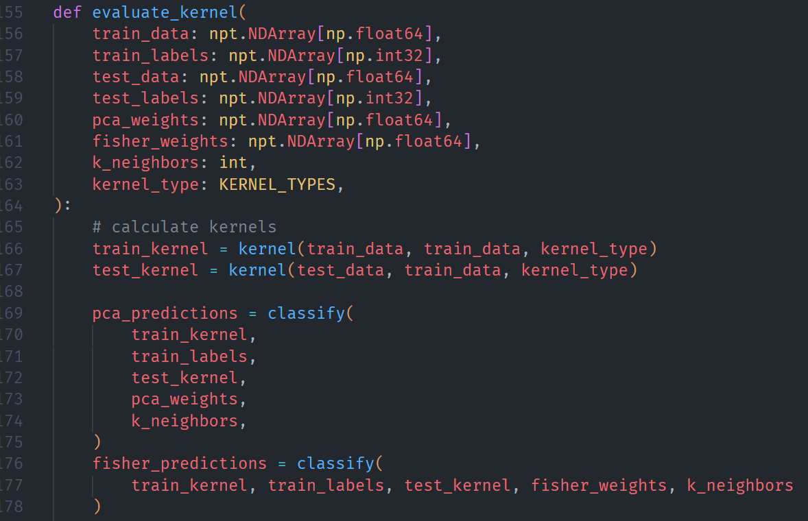

* `test.classify` function: use K-NN algorithm to classify images

  > Arguments
  > 	train_data: np.ndarray, shape (N, N), kernel matrix of train data
  > 	train_labels: np.ndarray, shape (N,), train data labels
  > 	test_data: np.ndarray, shape (K, N), kernel matrix of test data
  > 	weights: Kernel PCA or LDA weights, shape (N, E)
  > 	k_neighbors: int, k-NN
  >
  > 
  >
  > To project the data onto low dimensional space,
  >
  > $Z = K(X, X)A$
  
  

### t-SNE

#### Part1

* Algorithms
  * Symmetric SNE
    1. In practice, we calculate the conditional probability $p_{j|i}$ first in the original dimensional space.
    
       We also need to choose $N$ precisions for conditional probabilities to be the same perplexity (entropy) by using binary search.
    
       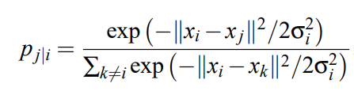
    
       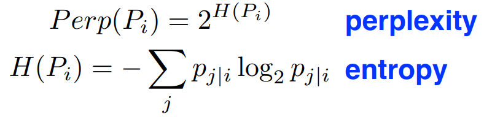
    
    2. Calculate the joint probability $p_{ij}$
    
       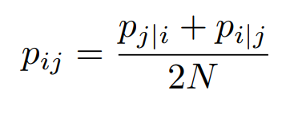
    
    3. Calculate the joint probability $q_{ij}$ in the low dimensional space (gaussian distribution)
    
       At the initial time, we need to randomly initialize $y$
    
       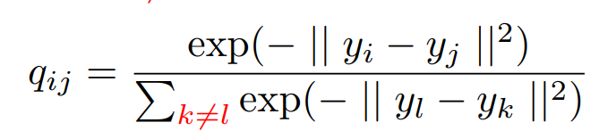
    
    4.  Calculate the gradient for each $y_i$
    
       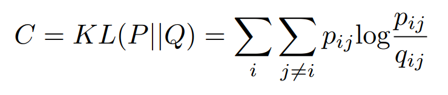
    
       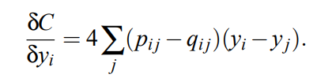
    
    5. Use optimization algorithm to update $y_i$ 
    
    6. Repeat 3rd, 4th and 5th steps until achieving the maximum loop or coverage
    
  * t-SNE
  
    1. In practice, we calculate the conditional probability $p_{j|i}$ first in the original dimensional space.
  
       We also need to choose $N$ precisions for conditional probabilities to be the same perplexity (entropy) by using binary search.
  
       
  
       
  
    2. Calculate the joint probability $p_{ij}$
  
       
  
    3. Calculate the joint probability $q_{ij}$ in the low dimensional space (student t-distribution)
  
       At the initial time, we need to randomly initialize $y$
  
       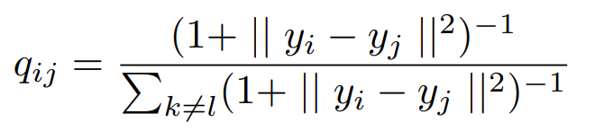
  
    4.  Calculate the gradient for each $y_i$
  
       
  
       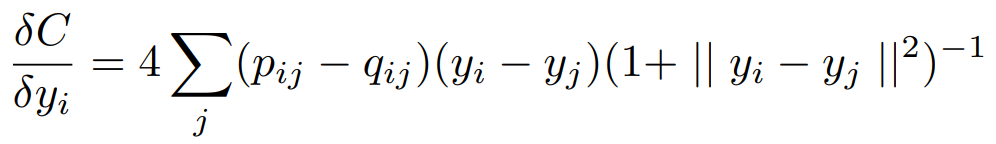
  
    5. Use optimization algorithm to update $y_i$ 
  
    6. Repeat 3rd, 4th and 5th steps until achieving the maximum loop or coverage

* `sne` function: initialize variables, such as variables for optimization algorithm, variable $Y$ for low dimensional space...

  > About PCA algorithm, the authors mention it in the paper, [Visualizing Data using t-SNE](https://lvdmaaten.github.io/publications/papers/JMLR_2008.pdf).
  >
  > So, they want to speed up the computation of pairwise distances between the datapoints.
  >
  > 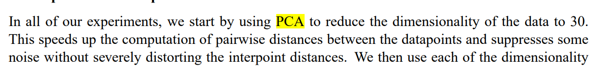

  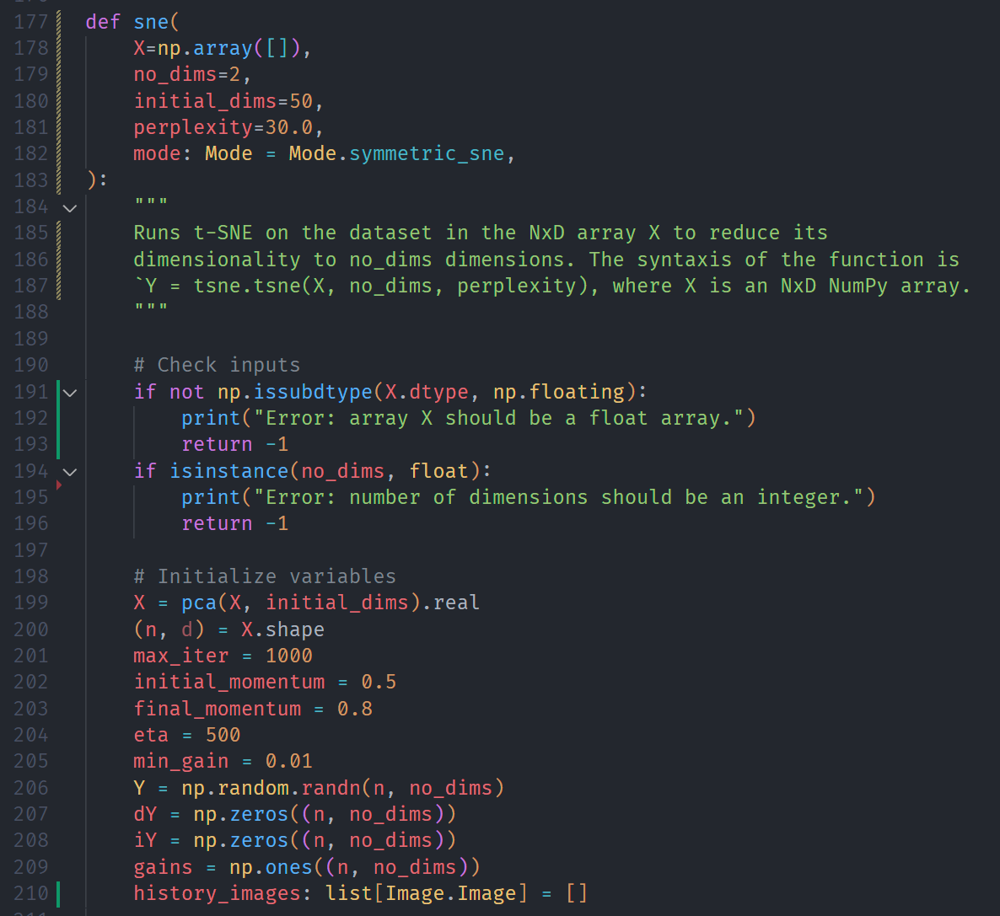

* `x2p` function: calculate $p_{i|j}$ conditional probability

  > Here, it corresponds to the first step of s-SNE and t-SNE.
  >
  > 
  >
  > In practice, we calculate the conditional probability $p_{j|i}$ first in the original dimensional space.
  >
  > We also need to choose $N$ precisions for conditional probabilities to be the same perplexity (entropy) by using **binary search**.
  >
  > 
  >
  > 

  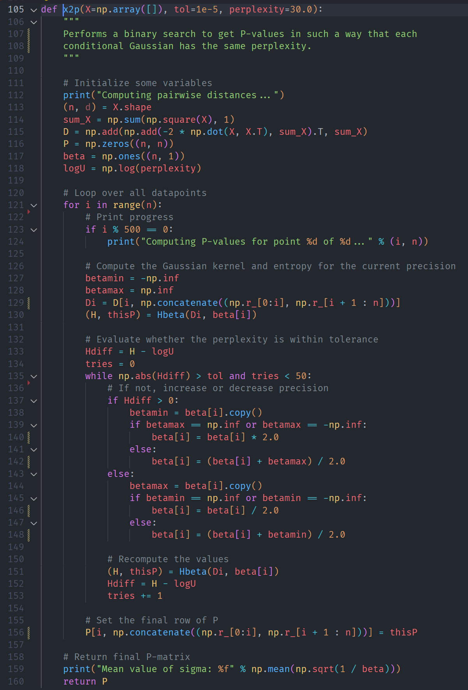

* `sne` function: after calculating the conditional probability $p_{i|j}$, then calculate joint probability $p_{ij}$

  > Here, it corresponds to the second step of s-SNE and t-SNE.
  >
  > 
  >
  > Calculate the joint probability $p_{ij}$
  >
  > 
  >
  > **Note**, you may notice that the denominator part is `np.sum(P)`.
  >
  > Because we already calculated the element-wise sum between $p_{j|i}$ and $p_{i|j}$ and also sum each row of $p_{j|i}$ or $p_{i|j}$ is equal to 1, the authors just sum them all as $2N$.
  >
  > (In my opinion, it is a little waste of computation. We could just calculate it with the shape size. I don't know why they do it like this.)
  >
  > 
  >
  > The early exaggeration method is just used for optimization. So, I don't explain it detailed. You could check their paper.
  >
  > The last line is used for numerical stability to avoid zero value.

  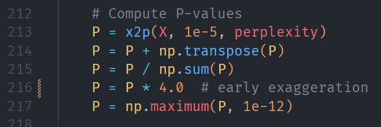

* `sne` function: optimize low dimensional feature $y_i$

  > Here, it corresponds to the 3rd, 4th and 5th step of s-SNE and t-SNE.
  >
  > 
  >
  > 3rd step (**Compute pairwise affinities**)
  >
  > * s-SNE (gaussian distribution)
  >
  >   
  >
  > * t-SNE (student t-distribution)
  >
  >   
  >
  > 4th step (**Compute gradient**)
  >
  > * s-SNE
  >
  >   
  >
  > * t-SNE
  >
  >   
  >
  > 5th step
  >
  > Use optimization algorithm to update $y_i$

  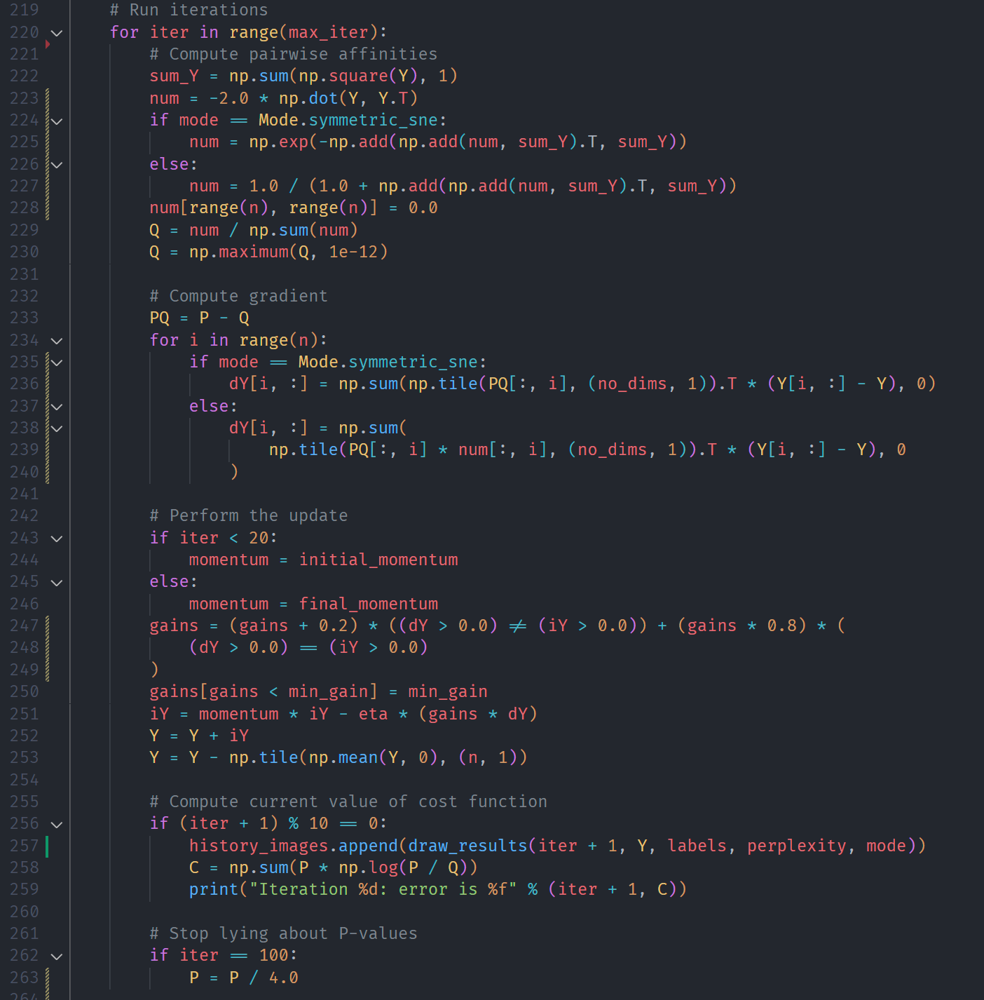

#### Part2

* `sne` function: record optimization procedure every 10 iterations

  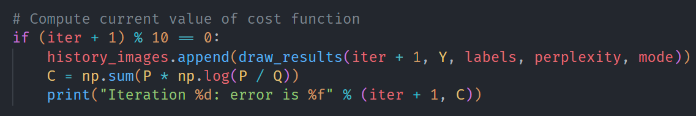

* `draw_results` function: draw low dimensional points $Y$ on the figure

  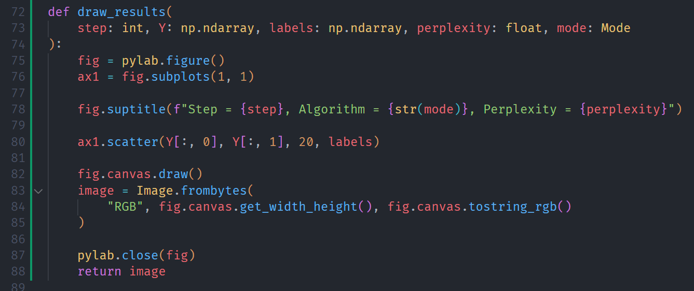

* `sne` function: save the results in gif format

  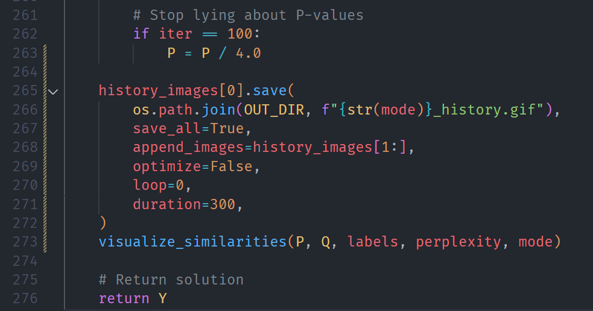

#### Part3

* `sne` function: visualize similarities $p_{ij}$ and $q_{ij}$

  

*  `visualize_similarities` function: visualize similarities $p_{ij}$ and $q_{ij}$

  > First, we sort the similarity matrix with gt labels in order to watch the relationship between the cluster and the gt labels.
  >
  > Then, normalize the similarity matrix by min-max normalization algorithm to keep their original relative similarity.

  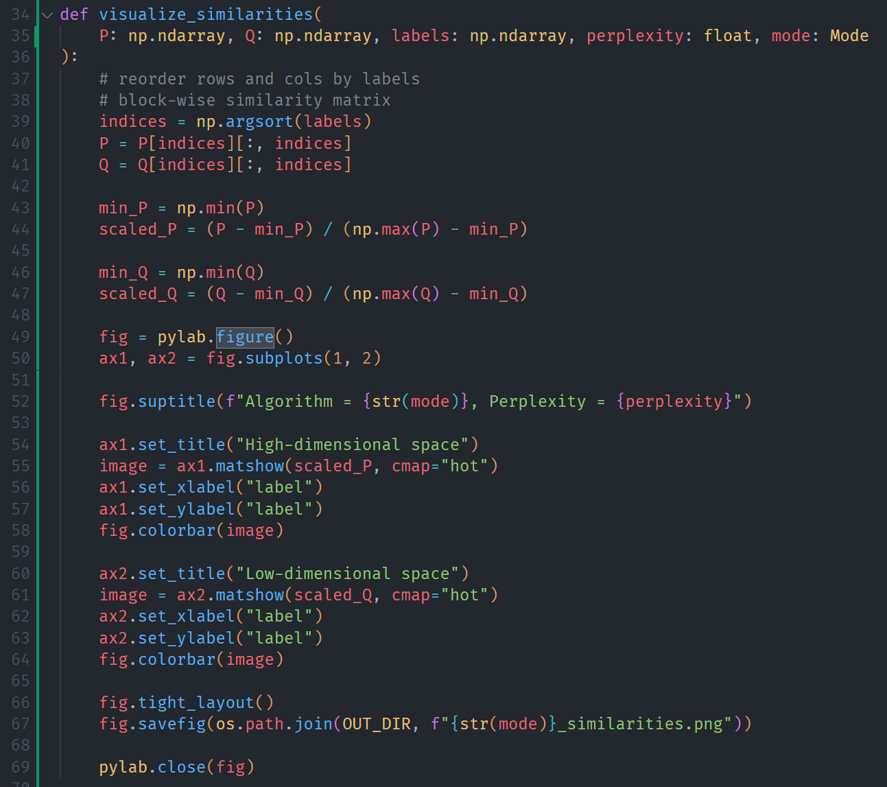

#### Part4

* `tsne.py` script: entry point

  > Use Enum class to control which mode I would like to use.
  >
  > Use arguments to control the algorithm and perplexity value.

  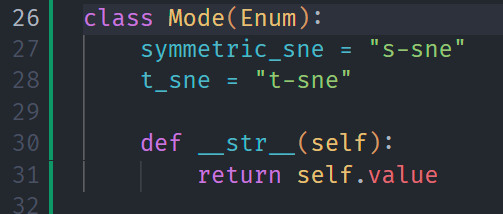

  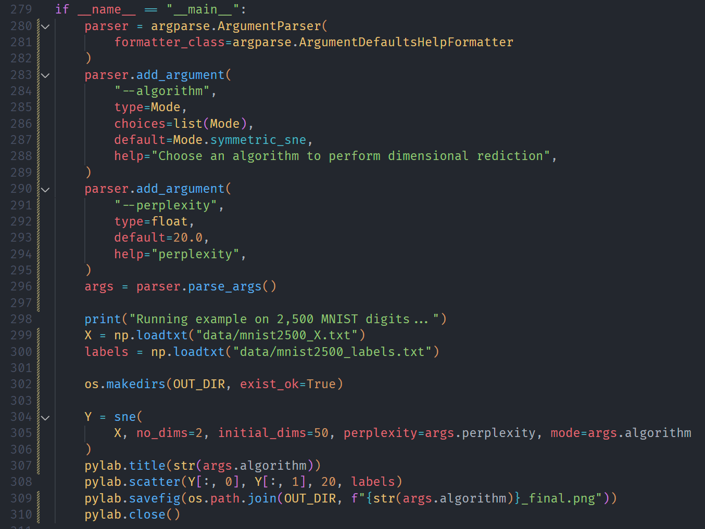

## Experiments settings and results & Discussion

### Kernel Eigenfaces

#### Part1

* Eigenfaces

  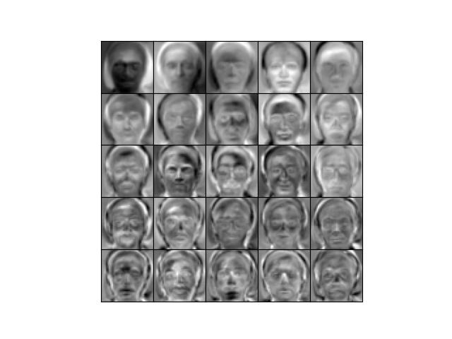

* Fisherfaces

  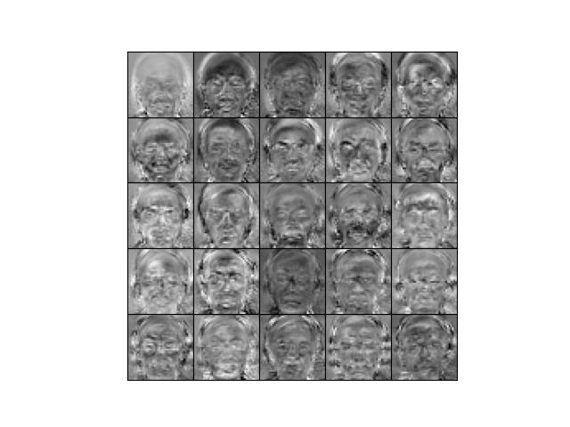

* Reconstructed faces from eigenfaces

  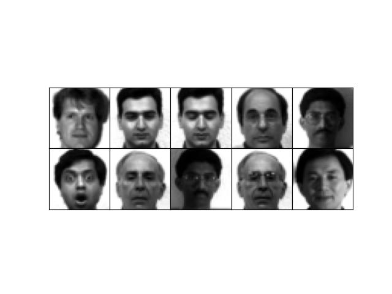

  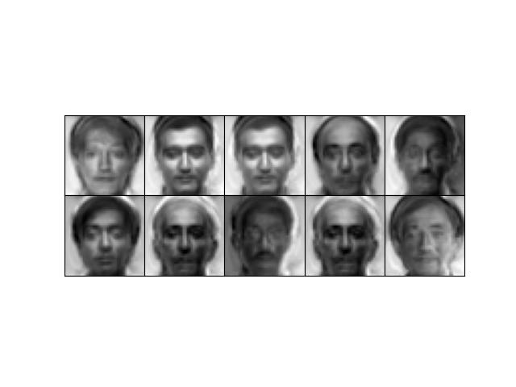

* Reconstructed faces from fisherfaces

  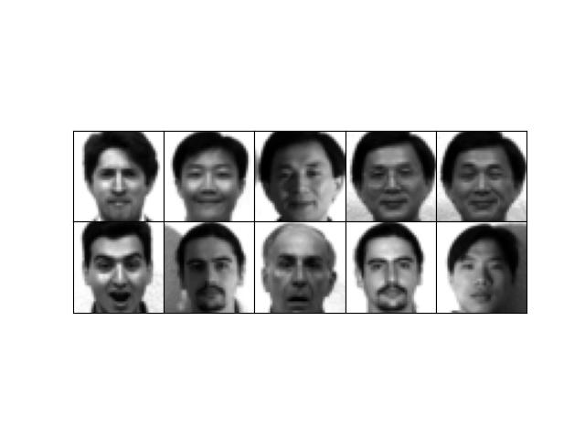

  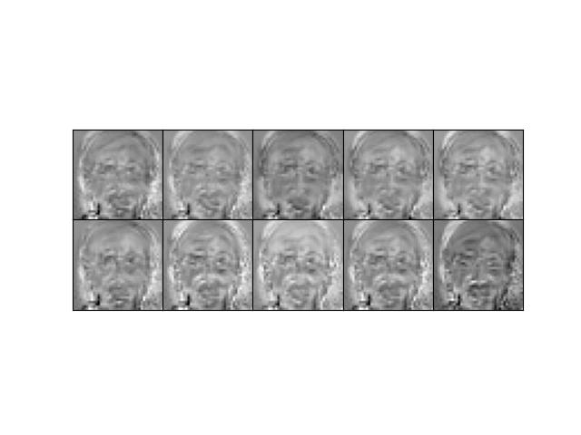

#### Part2

K-NN algorithm: PCA, LDA (Fisher)

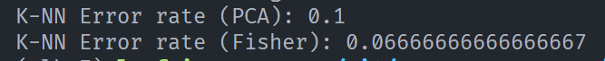

#### Part3

##### Observations

* Without kernel, it is better than others with kernel.

* LDA algorithm performs best.

* It is possible that the kernel function need more finetuning, e.g. grid search, to find the best parameters.

* As you can see the results with linear and polynomial kernel, they are very similar.

  It makes sense, because the linear kernel is a part of polynomial kerel.

* The results with RBF kernel is better than other two kernels'.

  It means that the data in feature space is very likely a gaussian distribution.

##### Results

* RBF Kernel

  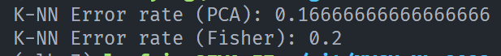

* Linear Kernel

  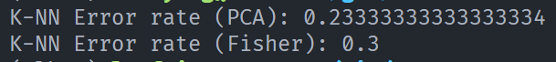

* Polynomial Kernel

  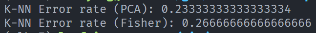

### t-SNE

#### Part1

##### Observations

From the results of s-SNE and t-SNE, we can know that the s-SNE has crowded problem (data points with different labels are highly overlapped).

So, in the low dimensional space, it proves that t-SNE uses student t-distribution to formulate the data points better than s-SNE's.

##### Results

* Symmetric SNE

  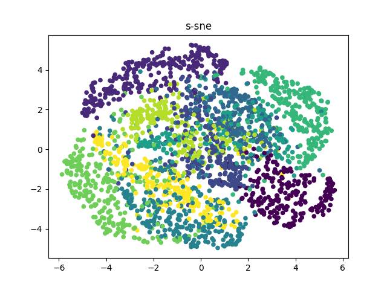

* t-SNE

  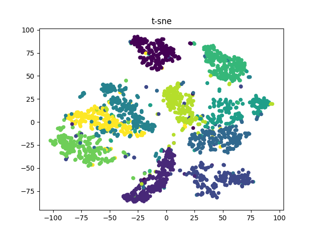

#### Part2

* s-SNE ([imgur gif](https://i.imgur.com/z9Nf4se.gif))

  

* t-SNE ([imgur gif](https://i.imgur.com/b3Z7cvK.gif))

  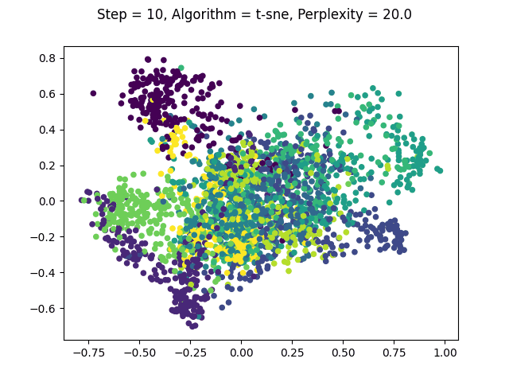

#### Part3

* s-SNE (too crowded in low dimensional space!)

  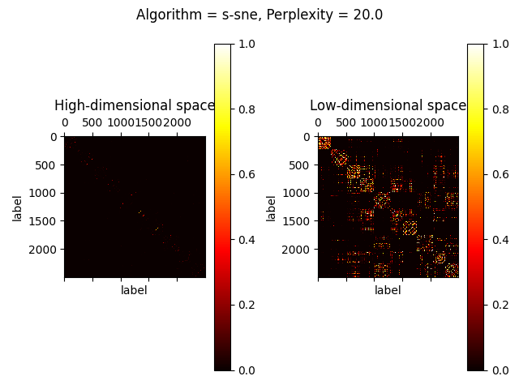

* t-SNE

  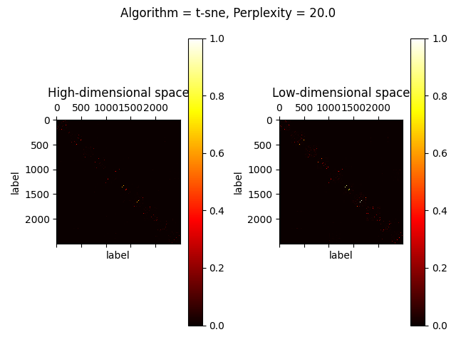

#### Part4

##### Observations

* In these points figures, we could know

  * when the perplexity is low (entropy is low), the variance of each group is very small.
  * when the perplexity is high (entropy is high), the variance of each group is very wide.
  * It proves that the perplexity will affect the choose of variance.

* The t-SNE figures always have a good ability to separate groups no matter what the perplexity is.

* From these s-SNE figures, it is hard to see any difference between them.

  But if we look from the similarity figures, we could see the difference.

  For instance, the perplexity is 5 and 35.

  **Look at the low dimensional space, because of the crowded problem, we could see the data points are very close.**

  **When the perplexity is going higher, the variance is wider. It is very obvious that the crowded problem is going worse. **

  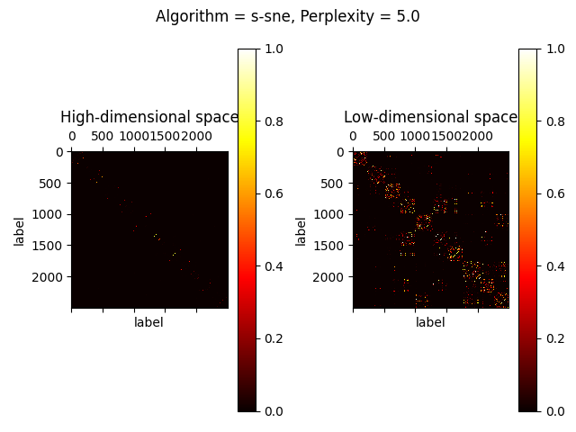

  

##### Results

* Perplexity = 5 ([imgur](https://i.imgur.com/BzsPILX.gif), [imgur](https://i.imgur.com/RpnYHgC.gif))

  

  

* Perplexity = 10 ([imgur](https://i.imgur.com/5fNWf5c.gif), [imgur](https://i.imgur.com/NL0gxUD.gif))

  

  

* Perplexity = 15 ([imgur](https://i.imgur.com/aw11rhB.gif), [imgur](https://i.imgur.com/huOPB2o.gif))

  

  

* Perplexity = 25 ([imgur](https://i.imgur.com/6vJm9io.gif), [imgur](https://i.imgur.com/XwC3oi0.gif))

  

  

* Perplexity = 30 ([imgur](https://i.imgur.com/V3J5pA9.gif), [imgur](https://i.imgur.com/dMzMyAd.gif))

  

  

* Perplexity = 35 ([imgur](https://i.imgur.com/ddSrH6z.gif), [imgur](https://i.imgur.com/7uYOMh4.gif))

  

  

## Observations and discussion

### Meaning of eigenface

The eigenfaces (eigenvectors) is extracted from eigen decomposition of the covariance matrix of data $X$.

In the geometry meaning, this process is to extract the independent vectors (eigenvectors).

The linear combination of these independent vectors can be the original data point.

So, a eigenface represents one of variance of human face that can be an independent factor.

* Eigenvectors (eigenfaces)

  

* Eigenvalues versus covariance

